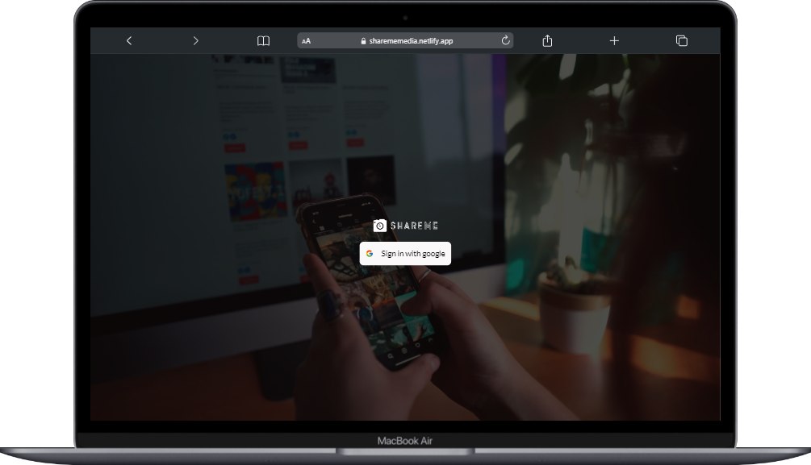

# ShareMe Social Media Application

A social Media web app where user sign-in with their Google account and can post picture, like, comment and save those picture with their own collection. This was built with Reactjs, Tailwind,  Google API and Sanity.io

## Demo link
👉 Demo : https://sharememedia.netlify.app/

